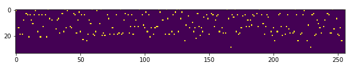
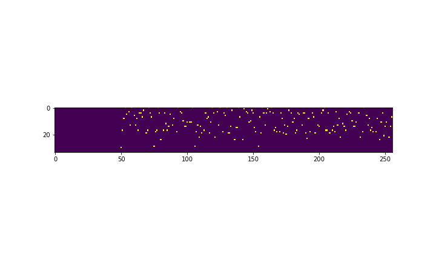
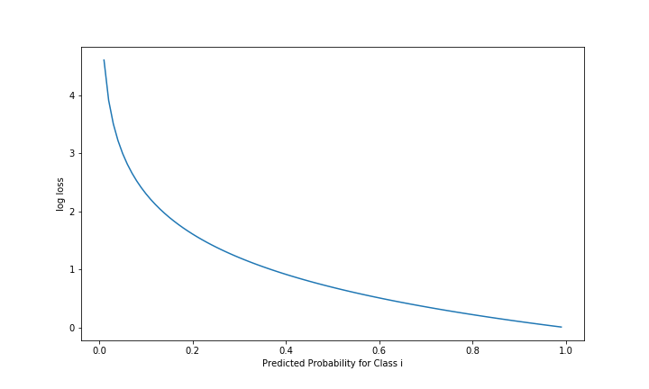

# Spooky Author Classification

by Alex Yee

---

### Objective

`id# | 'some string here' | 'HPL'`

1. HP Lovecraft
2. Mary Wollstonecraft
3. Edger Allan Poe

+++

### Vectorization

$$alphabet = abcdefghijklmnopqrstuvwxyz!&-,.'\"?$$

$$\vec{char(c)} = \left[0, 0, 1,\ldots,0\right]^{T}$$ 

+++

### Vectorization Cnt.

$$str("hello") = \begin{bmatrix}
\vert&\vert&\vert&\vert&\vert\\\
\vec{o}&\vec{l}&\vec{l}&\vec{e}&\vec{h}\\\
\vert&\vert&\vert&\vert&\vert\\\
\end{bmatrix}
$$

data = $M^{34x256}(\mathbb{Z})$

+++

### Data as Image

+++

### Data as Image Cnt.

---

### Log-Loss Function

$$-\dfrac{1}{N}\sum^{N}\_{i=1}\sum^{M}\_{j=1} y\_{ij}log(p\_{ij})$$

- $N = \text{# of samples}$
- $M = \text{# of possible labels}
- $y\_{ij} = \text{binary value denoting ith label for class j}$
- $p\_{ij} = \text{probability of sample i being class j}

+++

### Log-loss Behavior

